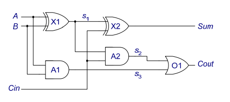
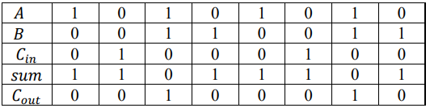
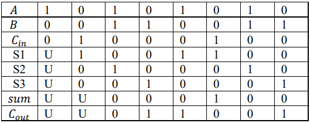

The gate-level diagram of the full adder is shown as follows.

**If we do not consider the delay**, the output can be directly written as

$$sum= A \oplus B \oplus C_{in}$$

$$C_{out}=(A \cdot B) + ((A \oplus B) \cdot C_{in})$$

The logic table is:

**If we consider the delay** and set the delay to one clock period, the logic expression of each intermediate signal and the output is

$$ s_1 = A \oplus B$$ 

$$ s_2 = Cin \cdot s_1 $$

$$ s_3 = A \cdot B $$

$$ sum = s_1 \oplus Cin $$

$$ Cout = s_2 + s_3 $$

Each assignment will be completed after one delay. The logic table is:

