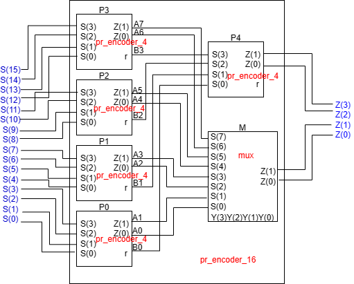
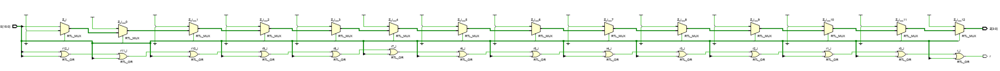
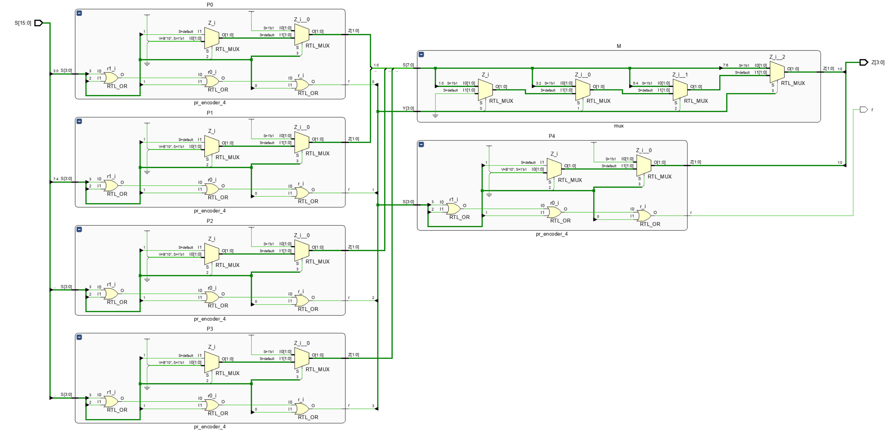

### Block Diagram
The bolck diagram of the tree-shaped priority decoder is shown below.

### RTL Schematic
For **cascade design**, every signal from input port to output port should pass through a sequence 2-to-1 multiplexers of length 14.

For **tree-shaped design**, the signal from input port to output port should pass through a sequence 2-to-1 multiplexers of a maximum length 6 (2 in the first layer and 4 in the second layer). 

