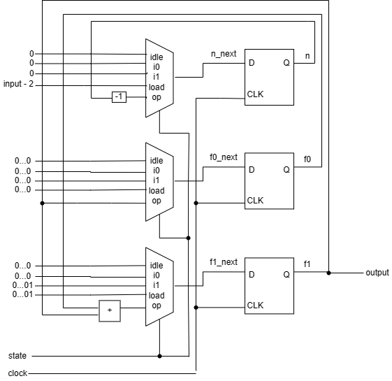
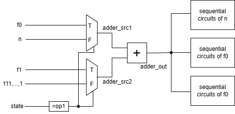
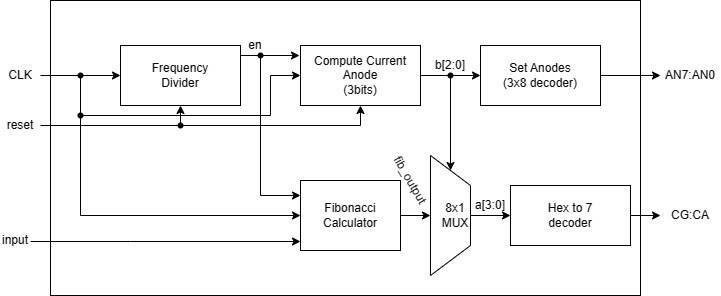

## 1. Introduction
In this experiment, we design a Fibonacci sequence calculator using Finite State Machine with Datapath (FSDM) and implement our design to the Nexys 4DDR board. The switches on the board are used to enter the number we need to calculate the Fibonacci sequence and the 7-segment display tubes are used to display the output.

The Fibonacci Sequence is the series of numbers:
0, 1, 1, 2, 3, 5, 8, 13, 21, 34, ..., where the next number is found by adding up the two numbers before it:
- the 2 is found by adding the two numbers before it (1+1),
- the 3 is found by adding the two numbers before it (1+2),
the 5 is (2+3),
- and so on.

And it can be fomulated as 
$$f(n) = 0, n = 0,$$
$$f(n) = 1, n = 1,$$
$$f(n) = f(n-2) + f(n-1), n \geq 3.$$

## 2. FSMD Design
### *Step 1: Defining the input and output signals*
Input Signals
- input: input operands. It is a 6-bit signal with std_logic_vector data type and interpreted as unsigned integers ranging from 0 to 63.
- CLK: system clock.
- RST: asynchronous reset signal for system initialization.

Output Signals
- output: the result. It is a 43-bit signal which is able to cover f(0) to f(63).
- ready: external status signal. It is asserted when the 
multiplication circuit is idle and ready to accept new inputs.


### *Step 2: Converting the algorithm to an ASM chart*
<div align=center>

</div>

### *Step 3: Constructing the FSMD*
The circuit requires 3 registers, to store the current function value f1, the last function value f0 and counter n respectively. The RT operations are shown as follows.

RT operation with the n register
- n &larr; 0 (in the idle, i0 and i1 state)
- f1 &larr; input - 2 (in the load state)
- f1 &larr; n-1 (in the op state)

RT operation with the f0 register
- f1 &larr; 0 (in the idle, i0, i1 and load state)
- f1 &larr; f1 (in the op state)

RT operation with the f1 register
- f1 &larr; 0 (in the idle and i0 state)
- f1 &larr; 1 (in the i1 and load state)
- f1 &larr; f1 + f0 (in the op state)

The complete conceputal diagram is shown as follows.

<div align=center>

</div>

### *Step 4: VHDL descriptions of FSMD*
Please refer to the codes.

## 3. Possible Improvements
The 43-bit adder and 6-bit decrementor can be shared by scheduling these operations in differnet states.
<div align=center>

</div>

The module related to the adder shoule be modified as shown in the diagram below..
<div align=center>

</div>

And the code should be modified as follows:

- Split the previous state 'op' to two states 'op1' and 'op2' and modify the case statement.

``` VHDL
            when op1 =>
                f1_next <= adder_out;
                f0_next <= f1;
                state_next <= op2;
            when op2 =>
                n_next <= adder_out(5 downto 0);
                if n = "000000" then
                    state_next <= idle;
                    start_next <= '0';
                else
                    state_next <= op1;
                end if;
```

 - Add a datapath input routing and functional units.
``` VHDL
process (state, f1, f0, n) is
begin
    if (state = op1) then
        adder_src1 <= f0;
        adder_src2 <= f1;
    else -- for op2 state
        adder_src1 <= “0000000000000000000000000000000000000” & n;
        adder_src2 <= x“FFFF”;
end if;
end process;
adder_out <= adder_src1 + adder_src2;
```
## 4. FPGA Board Implementation
We implememnt the Fibonacci Calculator to the Nexys4 DDR board. We use the swithes as the input port and the 7-segment digitial tubes to display the result. 

Since there is only 8 7-segment digital tubes on the board, it can only display 8 hexadecimal numbers (00000000 to FFFFFFFF). If there is a 6-bit input, the result may be out of display range, so the input is limited to 5 bits.

The block diagram of the implementation of the Fibonacci calculator with 7-segment digital displayer is shown as follows.
<div align=center>

</div>

The **I/O interface** is defined as follows.
| Signal      | PIN |  Discription      |
| ----------- | ----------- | --------- |
| CLK      | E3       |       SYSTEM CLOCK    |
| RESET | M17        |  The button on the right        |
| input [4:0] | R17, R15, M13, L16, J15 | The 5th switch on the right to the 1st switch on the right (from MSB to LSB)|
| AN [7:0] | U13, K2, T14, P14, J14, T9, J18, J17 |  The 8 ndoes for LED display   |
| LED [7:0] | T10, R10, K16, K13, P15, T11, L18, H15 | The 7 segments for a digital number display and a dicimal point (CA:CG and DP)   |
 
 ## 5. Summary
In this experiment, a Fibonacci sequence calculator is designed using Finite State Machine with Datapath (FSDM) with implementation to the Nexys 4DDR board. We follow the 4-step procedure for the FSMD design and test our system by various modes of simulation. Finally we implement our design to the FPGA development board utilizing the switches as input ports and the 7-segment display as output ports.

