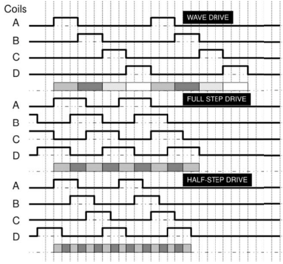

### Drive modes

In view of the operation principle of the 4-phase unipolar stepper motor, we have to generate 4 signals to control the 4 electromagnets. According to the different accuracy and torque, there are three modes: wave drive, full step drive and half step drive. 

In this lab, we adopt **full step drive**.

### Rotation speed and direction
In generating the impulse signal controlling the 4 electromagnets, we have to define proper frequency of the impulse, to control the speed of the rotation. By adjusting the duration of the impulses we can adjust the rotation speed. 

In our design:
- The direct of the rotation can be controlled by a switch.
- The speed of the motor can be controlled by two push buttons, one to increase the speed, and the other to decrease the speed.
- The rotation can be stopped and re-started by a push button.
