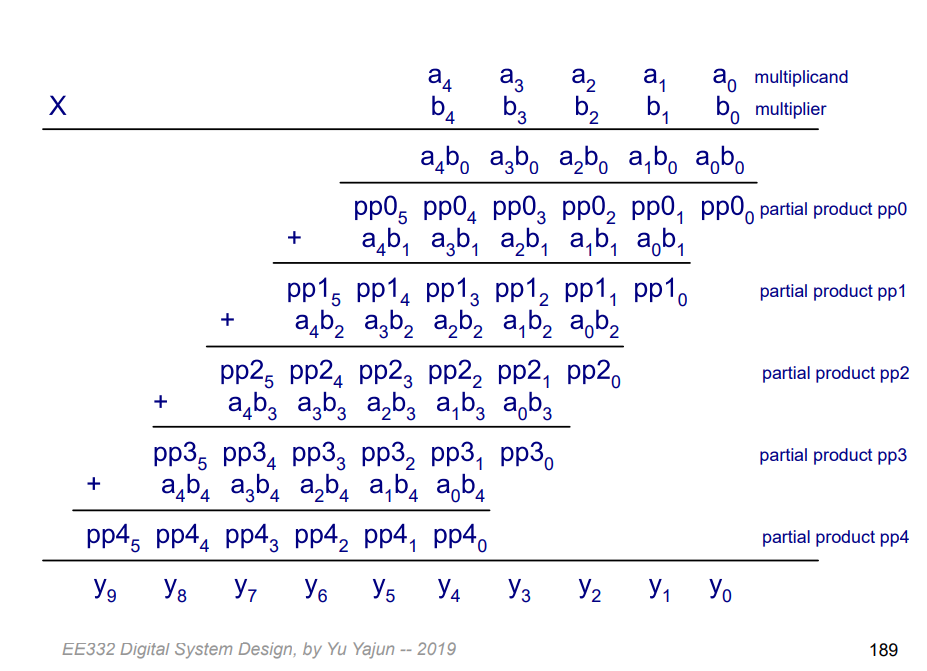
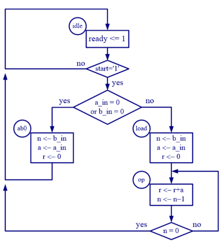
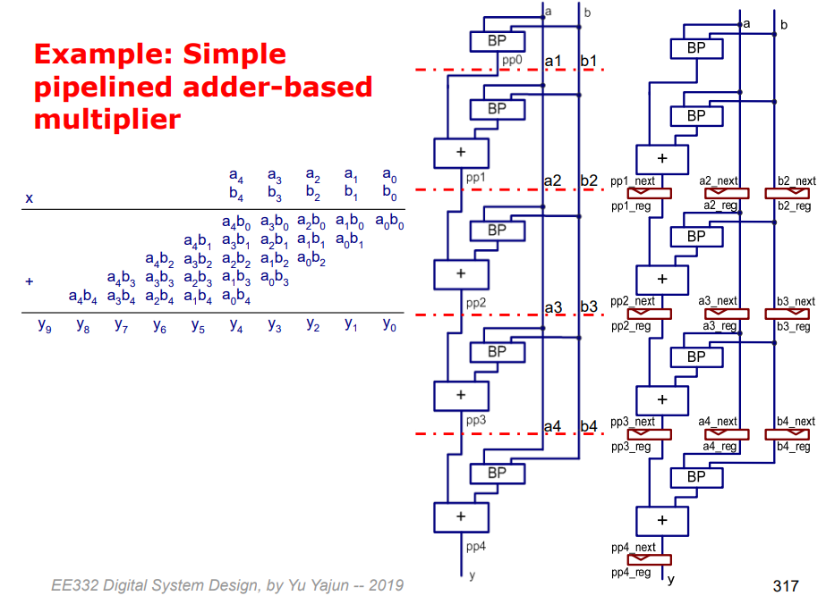
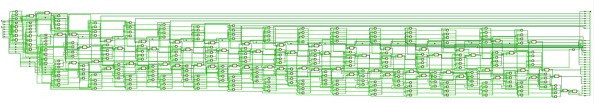
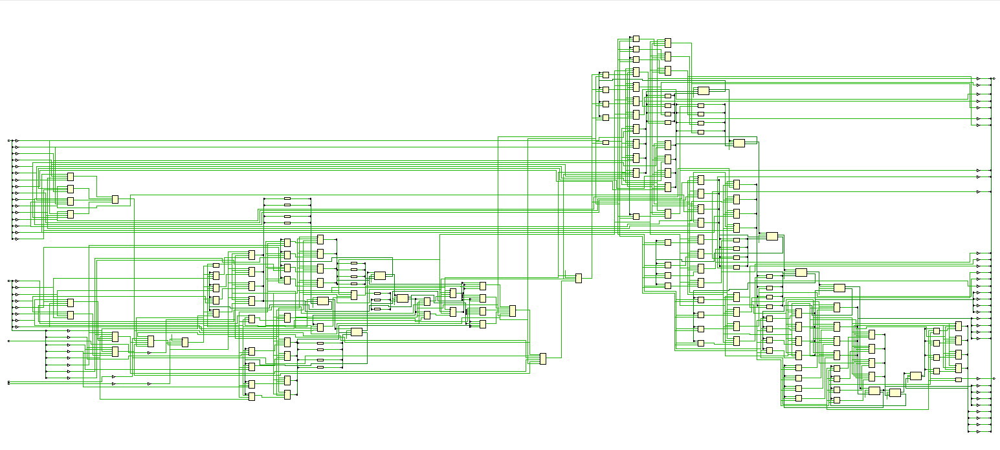
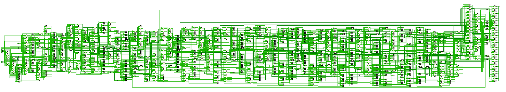
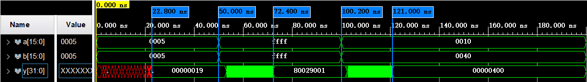
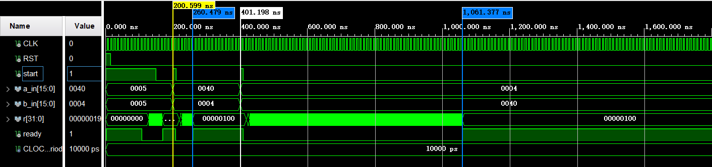
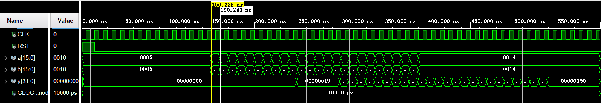

## 1. Introduction
In this experiment, we implement a 16-bit multiplier using three differnet strucutre:
- Combinational design
- Repetitive-addition design
- Pipelined design

And we compare the cost and performance of these three different structures.

## 2. Implementation
### 1) Combinational design
The algorithm includes three steps:
- Multiply the digits of the multiplier by the multiplicand one at a time.
- Shift the partial product to left.
- Add the shifted partial product terms to obtain the final product.
<div align=center>

</div>
The figure above is an example of 5-bit multiplier from page 189, part 2, of the slides of this course. Noted that our design is 16-bit.

### 2) Repetitive-addition design
We implement the repetitive addition multiplier with finite state machine (FSM), which calculates $a \cdot b$ by repetitively add $a$ for $b$ times.
<div align=center>

</div>
The figure above is an ASM chart of our design.

### 3) Pipelined design
We divide the chain of addition of partial preoducts into stages of similar propagation delays. And insert registers for these signals in the boundary.

<div align=center>

</div>
The figure above is an example of the pipelined design of a 5-bit multiplier from page 317, part 2 of the slides of this course. Noted that our design is 16-bit. And our design can easily be converted to n-bit multiplier with the utilization of generic.

## 3. Comparison
### a. Schematic comparison
(1) Combinational design
<div align=center>

</div>
(2) Repetitive-addition design
<div align=center>

</div>
(3) Pipelined design
<div align=center>

</div>

**Discussions:**

The schematic of the repetitive-addition design is more complex than that of the combinational design, especially in the width of the circuit. This is because the combinational design is a simple combinational logic circuit and the repetitive-addition design is a sequential logic circuit, which consists of some registers and feedback signal.

The schematic of the pipelined design is much more comlex than that of the other two, since large amount of registers are utilized to store the data temporarily and realize the pepeline structure.

### b. Timing comparison
We compare the timing of these three designs with post-systhesis timing simulation. 

(1) Combinational design
<div align=center>

</div>
For the combinational circuit, the circuit needs approximately 23ns to respond to the input change and get a stable output.

(2) Repetitive-addition design
<div align=center>

</div>

|Experiment No.   | a (in decimal)| b(in decimal) | time for computing (approximately)|
| ----------- | ----------- | --------- | --------  |
|1           |    5         |     5     | 80ns   |
|2           |    64         |     4    | 60ns |
|3           |    4         |     64    | 660ns |

For the repetitive-addition design, because it is a sequential logic circuit, the response time is related to the number of clocks that the computation requires. The time cost is approximately the number of times of addition (i.e. the value of b) plus clock period since it is realized by repetitive addition.

(3) Pipelined design
<div align=center>

</div>

The pipelined design can significantly increase the throughput of the multiplier. The time cost for one calculation is approximately 15ns. And the minimum interval $T_c$ between two inputs is 10ns, that is, one clock period, which means that we can input next number 10ns' later than last input.

- Propagation delay:
$$
T_{pipe} = 15T_c = 15 \cdot 10ns = 150ns.
$$

- Throughput:
$$
\lim_{k \to \infty}\frac{k}{15T_c+kT_c} = \frac{1}{Tc} = \frac{1}{10ns} = 10^8 s^{-1}.
$$

**Discussions:**

- The combinational design is a combinational logic circuit with combinational circuit testbench, while the other two designs are sequential logic circuits with sequential circuit testbench, so that the combinational design is not comparable with other two designs in terms of timing simulation.

- For the repetitive-addition design, the time cost for one computation is related to the input (i.e. the value of $b$) since $b$ will affect the time of multiplication, while for the pipelined design the time cost for one computation is fixed since the time for multiplication and addition is fixed whatever the input is. Thus, different design structure leads to different timing.

- For the pipelined design, the throughput can be significantly increased since it can receive a new input even before the last calculation finished. But for the repetitive-addition design, one cannot input another number until the last calculation completes.
 
 ## 4. Summary
In this experiment, we implement a 16-bit multiplier using three differnet strucutre: combinational design, repetitive-addition design and pipelined design. And we also compare the cost and performance of these three different structures. Through this experiment we realize the effect of the circuit design to its perfromance, even the logic of the code in high-level language is the same. 

## 5. Acknowledgement
- Three figures in senction ```2.Implementation``` is cut from the lecture slides of EE332 at SUSTech, by Prof. Yajun Yu.

- Some codes of pipelined design is provided by Yufei Wu.
